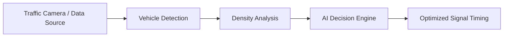

# 🚦 SmartTrafficOptimizer

> **AI-powered traffic flow optimization using data, vision, and intelligent decision-making**


---

## 🌍 Problem Statement

Urban traffic congestion causes **time loss, fuel waste, pollution, and stress**. Traditional traffic signals operate on fixed timers and **ignore real-time road conditions**.

**SmartTrafficOptimizer** dynamically optimizes traffic signals using **AI, computer vision, and live data** to reduce congestion and improve flow.

---

## ✨ Key Features

✅ Real-time traffic density detection
✅ Intelligent signal timing optimization
✅ Computer Vision–based vehicle counting
✅ Emergency vehicle priority handling 🚑🚓
✅ Historical data analysis & prediction
✅ Scalable & modular architecture

---

## 🧠 How It Works



1. Capture live traffic feed or dataset
2. Detect & count vehicles using CV
3. Analyze congestion level
4. AI model decides optimal green/red timing
5. Signals update dynamically

---

## 🛠️ Tech Stack

| Layer           | Technology                |
| --------------- | ------------------------- |
| Language        | Python                    |
| AI/ML           | Scikit-learn / TensorFlow |
| Computer Vision | OpenCV                    |
| Data            | Pandas, NumPy             |
| Visualization   | Matplotlib                |
| Optional        | IoT / Sensors / APIs      |

---

## 📁 Project Structure

```bash
SmartTrafficOptimizer/
│
├── data/               # Traffic datasets
├── models/             # Trained ML models
├── vision/             # CV vehicle detection logic
├── optimizer/          # Signal optimization engine
├── utils/              # Helper functions
├── main.py             # Entry point
├── requirements.txt
└── README.md
```

---

## 🚀 Getting Started

### 1️⃣ Clone the Repo

```bash
git clone https://github.com/your-username/SmartTrafficOptimizer.git
cd SmartTrafficOptimizer
```

### 2️⃣ Install Dependencies

```bash
pip install -r requirements.txt
```

### 3️⃣ Run the Project

```bash
python main.py
```

---

## 📊 Sample Output

* Vehicle count per lane
* Optimized signal duration (seconds)
* Reduced waiting time
* Congestion heatmap

*(Add screenshots / GIFs here for extra impact 🔥)*

---

## 🔮 Future Enhancements

🔹 Deep Learning–based detection (YOLO)
🔹 Real-time CCTV integration
🔹 Reinforcement Learning for signals
🔹 Smart city dashboard
🔹 Mobile app integration

---

## 👨‍💻 Author
Hadia abbas
Ali haider
Computer Science Student 
📍 Pakistan


---


---

> *"Optimizing traffic today for smarter cities tomorrow."* 🚦
